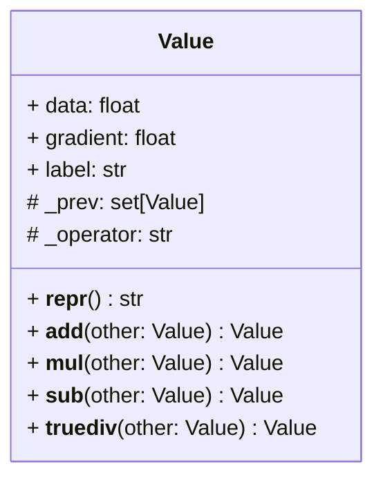

# Micrograd
Building neural networks from scratch.

This repository is built to replicate the existing [micrograd library](https://github.com/karpathy/micrograd) build by Andrej Karpathy.

## Value Object
The Value object is the smallest unit in a neural network. 



## Graphical Representation of Mathematical Operations
```python
a = Value(2.0, label='a')
b = Value(-3.0, label='b')
c = Value(10.0, label='c')
e = a*b; e.label = 'e'
d = e + c; d.label = 'd'
f = Value(-2.0, label='f')
L = d * f; L.label = 'L'
```


## The Neuron
WIP

## The Network Layer
WIP

## The Neural Network
WIP

## Forward Propagation 
WIP

## Back Propagation
WIP again.

## Neural Network Training
You guessed it, WIP.