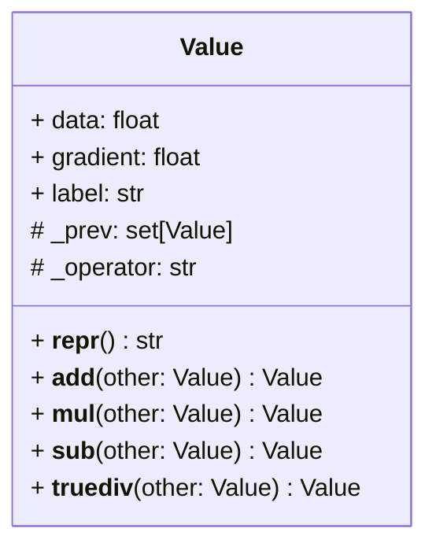

# Micrograd
Building neural networks from scratch.

This repository is built to replicate the existing [micrograd library](https://github.com/karpathy/micrograd) build by Andrej Karpathy.

## Value Object
The Value object is the smallest unit in a neural network. 



## Back Propagation

Back-propagation is the process of finding out how a previous value affects the final value.

Consider the following network:
```python
a = Value(2.0, label='a')
b = Value(-3.0, label='b')
c = Value(10.0, label='c')
e = a*b; e.label = 'e'
d = e + c; d.label = 'd'
f = Value(-2.0, label='f')
L = d * f; L.label = 'L'
```


When we back-propagate, we find out what is the effect any of the previous nodes on L:
- effect of changing a
- effect of changing b
- effect of changing e 
- effect of changing c 
- effect of changing d 
- effect of changing f

This can be calculated by taking the partial derivative of the previous node with respect to the final node 'L'.

### Calculus: Definition of a Derivative as a Limit

```math
\frac{d}{dx} f(x) = \lim_{h \to 0} \frac{f(x + h) - f(x)}{h}
```

#### How a Change in 'd' Affects 'L' (Proof)
Let's calculate how any change in 'd' affects L:
```math
L = d * f
```
```math
\frac{dL}{dd} = \lim_{h \to 0} \frac{(f(d+h) - f(d))}{h}
```
```math
\frac{dL}{dd} = \lim_{h \to 0} \frac{(((d+h)*f) - (d*f))}{h}
```
```math
\frac{dL}{dd} = \lim_{h \to 0} \frac{(df+hf - df)}{h}
```
```math
\frac{dL}{dd} = \lim_{h \to 0} \frac{(df+hf - df)}{h}
```
```math
\frac{dL}{dd} = \lim_{h \to 0} \frac{hf}{h}
```
```math
\therefore \frac{dL}{dd} = f
```

Similarly:
```math
\frac{dL}{df} = d
```