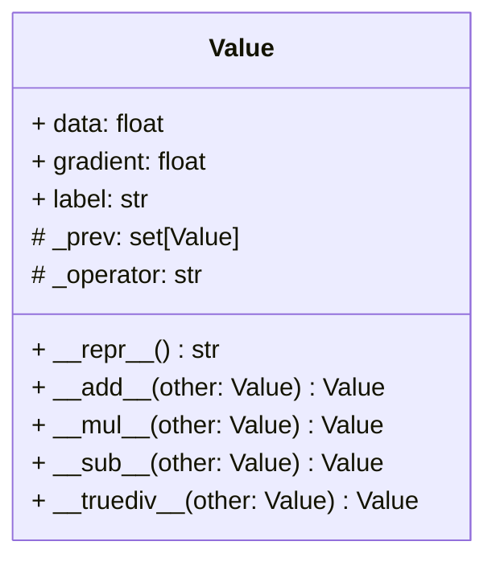

# Micrograd
Building neural networks from scratch.

This repository is built to replicate the existing [micrograd library](https://github.com/karpathy/micrograd) build by Andrej Karpathy.

## Value Object
The Value object is the smallest unit in a neural network. 

## The Neuron
WIP

## The Network Layer
WIP

## The Neural Network
WIP

## Forward Propagation 
WIP

## Back Propagation
WIP again.

## Neural Network Training
You guessed it, WIP.