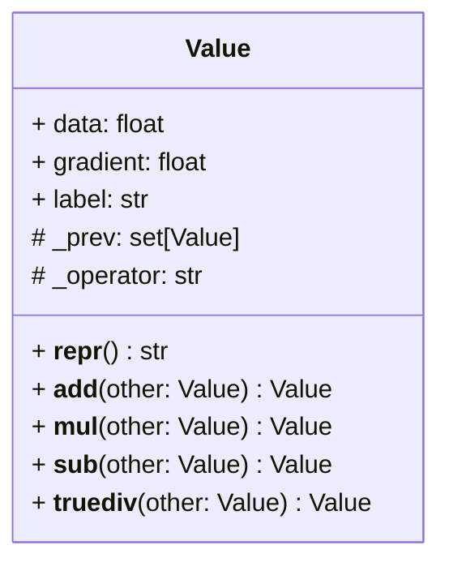
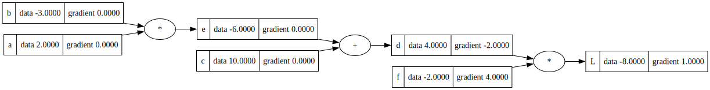
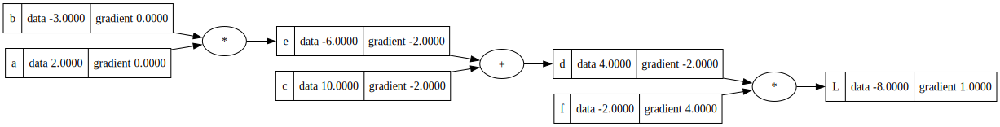
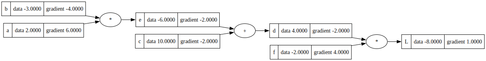

# Micrograd
Building neural networks from scratch.

This repository is built to replicate the existing [micrograd library](https://github.com/karpathy/micrograd) build by Andrej Karpathy.

## Value Object
The Value object is the smallest unit in a neural network. 



## Back Propagation

Back-propagation is the process of finding out how a previous value affects the final value.

Consider the following network:
```python
a = Value(2.0, label='a')
b = Value(-3.0, label='b')
c = Value(10.0, label='c')
e = a*b; e.label = 'e'
d = e + c; d.label = 'd'
f = Value(-2.0, label='f')
L = d * f; L.label = 'L'
```


When we back-propagate, we find out what is the effect any of the previous nodes on L:
- effect of changing a
- effect of changing b
- effect of changing e 
- effect of changing c 
- effect of changing d 
- effect of changing f

This can be calculated by taking the partial derivative of the previous node with respect to the final node 'L'.

### Calculus: Definition of a Derivative as a Limit

```math
\frac{d}{dx} f(x) = \lim_{h \to 0} \frac{f(x + h) - f(x)}{h}
```

#### How a Change in 'd' Affects 'L' (Proof)
Let's calculate how any change in 'd' affects L:
```math
L = d * f
```
```math
\frac{dL}{dd} = \lim_{h \to 0} \frac{(f(d+h) - f(d))}{h}
```
```math
\frac{dL}{dd} = \lim_{h \to 0} \frac{(((d+h)*f) - (d*f))}{h}
```
```math
\frac{dL}{dd} = \lim_{h \to 0} \frac{(df+hf - df)}{h}
```
```math
\frac{dL}{dd} = \lim_{h \to 0} \frac{hf}{h}
```
```math
\therefore \frac{dL}{dd} = f = -2
```

Similarly:
```math
\frac{dL}{df} = d = 4
```

Updating the graph with the gradients of d & f:



### Calculus: Chain Rule
When z is a function of y, and y is a function of x:
```math
z = f(y)
```
```math
y = f(x)
```
Then the chain rule can be stated as:
```math
\frac{dz}{dx} = \frac{dz}{dy} \cdot \frac{dy}{dx}
```

#### How a Change in 'c' & 'e' Affects 'L' (Proof)
Our network expressions are as follows:
```math
d = e + c
```
```math
L = d +f
```
Now using the chain rule, we can see the impact of 'c' on 'L' as:
```math
\frac{dL}{dc} = \frac{dL}{dd} \cdot \frac{dd}{dc}
```
First let's calculate the impact of 'c' on 'd' using the definition of a derivative:
```math
\frac{dd}{dc} = \lim_{h \to 0} \frac{f(c + h) - f(c)}{h}
```
```math
\frac{dd}{dc} = \lim_{h \to 0} \frac{(e+c+h) - (e+c))}{h}
```
```math
\frac{dd}{dc} = \lim_{h \to 0} \frac{e+c+h-e-c}{h}
```
```math
\frac{dd}{dc} = \lim_{h \to 0} \frac{h}{h}
```
```math
\frac{dd}{dc} = 1
```
From our previous result, we already know that 
```math
\frac{dL}{dd} = f = -2
```
Now putting it all together in the chain rule:
```math
\therefore \frac{dL}{dc} = -2 \times 1 = -2
```

Similarly using the chain rule, we can see the impact of 'e' on 'L' as:
```math
\frac{dL}{de} = \frac{dL}{dd} \cdot \frac{dd}{de}
```
```math
\frac{dd}{de} = 1
```
```math
\therefore \frac{dL}{de} = 1 \times -2 = -2
```

Updating the graph with the gradients of c & e:



#### How a Change in 'a' & 'b' Affects 'L'
Similarly, to find how a change in 'a' affects 'L':
```math
\frac{dL}{da} = \frac{dL}{de} \times \frac{de}{da}
```
```math
\because  \frac{de}{da} = b = -3
```
```math
\frac{dL}{da} = -2 \times -3 = 6
```

To find out how a change in 'b' affects 'L':
```math
\frac{dL}{db} = \frac{dL}{de} \times \frac{de}{db} = -2 \times 2 = -4
```

### Final Graph After 1 Round of Back Propagation
